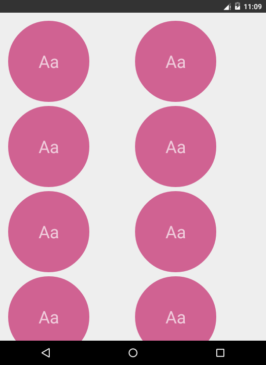
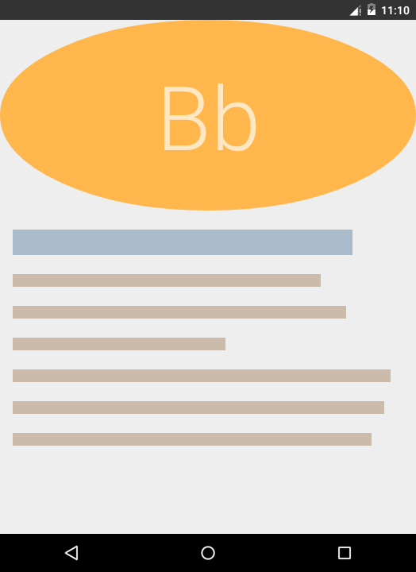

# activity-transitions

Between-activity motion.

## Introduction :point_up:

This repository holds code for a very basic Android app that shows how to implement movement when switching between activities. I met this app during an online [Udacity](https://www.udacity.com/) class called [Material Design for Android Developers](https://www.udacity.com/course/material-design-for-android-developers--ud862). Original code for the app dwells in [this](https://github.com/udacity/ud862-samples) repository under a folder called [L4_06_Q](https://github.com/udacity/ud862-samples/tree/master/L4_06_Q).

## Version History :package:

**latest** 	[Activity Transitions v1.0.0](https://github.com/joshua-kairu/activity-transitions/releases/download/v1.0.0/Activity-Transitions-v1.0.0.apk) 	Monday, July 11, 2016

This repo tries its best to follow the [Semantic Versioning](http://semver.org/) guidelines.

## How To Use :wrench:

:zero: Install and run the app.

:one: You will find a screen full of items reading `Aa`. Looks something like:

 

:two: Tapping one of the `Aa`s leads to some items sliding from the top of the screen and forming a screen with a `Bb` on top.

 

:three: Tapping the "Back" button results in the `Bb` things moving in reverse direction, leaving going back to the `Aa`s.

 

## How It Works

What is happening here is an [Activity Transition](https://developer.android.com/training/material/animations.html#Transitions). When an activity is started (say, by another activity), the started activity is said to enter and the starting activity is said to leave. Entering to and leaving from what, I don't know. :bowtie:  

In the [styles.xml](https://github.com/joshua-kairu/activity-transitions/blob/master/app/src/main/res/values/styles.xml) file we have declared a [theme](https://developer.android.com/guide/topics/ui/themes.html#DefiningStyles) called `Details` since `Bb` does look like a details screen :smile:. 

In the [Android Manifest](https://developer.android.com/guide/topics/manifest/manifest-intro.html) file, we have declared that the Details activity (aka the `Bb` screen) should use the `Details` theme.

So, what's good about the `Details` theme? In this theme, there is the line 

```xml 
<item name="android:windowEnterTransition">@transition/slide_top</item>
```

This tells Android to use the transition called `slide_top` when the activity implementing this theme enters.

The transition `slide_top` is declared in the `/res/transition` folder. It looks like this:

```xml
<slide

    xmlns:android="http://schemas.android.com/apk/res/android"

    android:slideEdge="top"

    android:duration="700"

    >

    <!--

    Slide everything except the nav and status bars

    -->

    <targets>

        <target android:excludeId="@android:id/navigationBarBackground" />

        <target android:excludeId="@android:id/statusBarBackground" />

    </targets>

</slide>
```

It slides things from the top for 700 ms.

For this to work, some (not `XML`) code needs to be written. In the click listener for each of the items in `Aa`, we have the lines:

```java
	Bundle transitionStarterBundle = ActivityOptions.makeSceneTransitionAnimation( MainActivity.this ).toBundle();

        ...

        startActivity( new Intent( MainActivity.this, DetailsActivity.class ), transitionStarterBundle );
```

The [Bundle](https://developer.android.com/reference/android/os/Bundle.html) tells Android to start the Details activity using a transition. Android will use the transition declared in XML to make this happen.

Simple as that. :end:

Oh, wait. And when the back button is tapped, Android does an exit animation, which by default is a reverse of the enter animation. That is why the `Bb` items slide back up when switching from `Bb` to `Aa`.

Simple as that. :end::wink:

## Abilities :muscle:

This app:
* Shows a basic transition animation between two activities.

## Limitations :worried:

This, as said earlier, is a very basic app. It does not provide any functionality.

## Possible Future Work :fast_forward:

As of Friday, June 17, 2016, some work that can be done in the future could be: 
- [ ] Allow users to choose which transition they would like to see. There are quite a number of cool transitions such as [explode](https://developer.android.com/reference/android/transition/Explode.html) and [fade](https://developer.android.com/reference/android/transition/Fade.html). 

## Other things :books:

Thumbs up :+1: to:
* Udacity for the knowledge that helped in the creation of this app.
* Jake Wharton for [Butter Knife](http://jakewharton.github.io/butterknife/), a library for binding fields to views in Android. The grid in `Aa` used this for assisting in the click listening.
* Why no video? :question: Well, I current have a pre-Lollipop device. I couldn't get this to work in [AppCompat](https://developer.android.com/topic/libraries/support-library/features.html#v7-appcompat) so I had to use the emulator. Emulator does not allow recording. :disappointed_relieved: 

## License :lock_with_ink_pen:

This repository is licensed under the [GNU General Public License Version 3](http://www.gnu.org/licenses/gpl-3.0.en.html).
